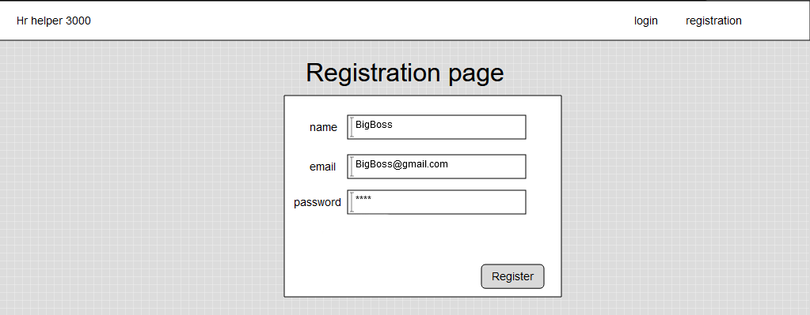
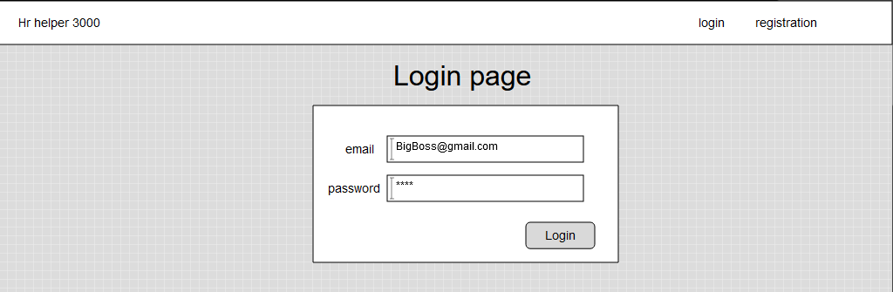
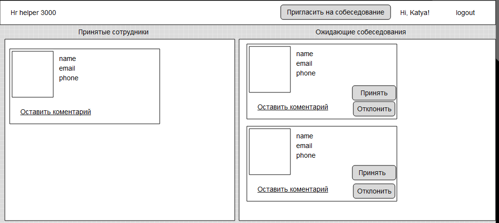
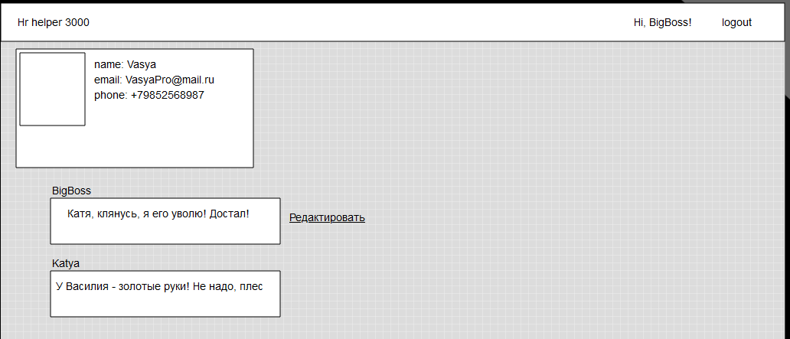
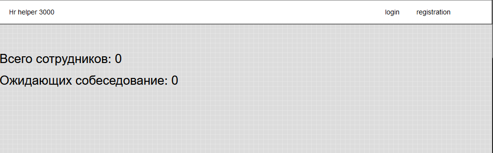

# Exam: Управление персоналом

### Введение
Необходимо создать mvp приложения управления персоналом. Пользователи твоего приложения смогут приглашать людей на собеседование, оставлять комментарии к анкетам, нанимать и увольнять сотрудников.
<!-- Старайся применить по максимуму все изученные конвенции и стандарты. -->
*Важно:*
Делай  `git push`  только один раз (в 16.00), в течение экзамена ничего пушить не нужно!

**Сначала прочитай всё задание целиком!**

Если не получается сделать какой-то релиз, переходи к следующему.

### Pre-release: Setup
Убедись,что в твоем проекте есть файл .gitignore, package.json и установлены все необходимые библиотеки. Создай базу данных. Проинициализируй eslint.

### Release 0: User Registration
Первое, что нужно сделать - это регистрация пользователей. Не забудь про шифрование паролей. Ты можешь использовать для этого [sha256](https://www.npmjs.com/package/sha256) или более продвинутую библиотеку [bcrypt](https://www.npmjs.com/package/bcrypt). Называй свои routings в стиле REST. Тебе поможет вот эта статья на Хабре: [REST API Best Practices](https://habr.com/post/351890/).

Добавь в шапку сайта ссылки на регистрацию и на домашнюю страницу. Реализуй регистрацию. У каждого пользователя обязательными полями будут **name**, **email**, **role** и **password**.

  
*Рисунок 1*. Форма регистрации.

### Release 1: Login/Logout
Добавь в шапку сайта кнопку "login", ведущую на соответствующую страницу. Не забудь обрабатывать ошибки: если у пользователя не получается залогиниться - ему нужно знать причину. При успешном входе - вместо кнопки "login" должна появляться "logout". При нажатии на logout пользователь выходит из системы и оказывается на домашней странице. На данном этапе домашняя страница может быть пустой, позже на ней будут отображаться количество сотрудников принятых на работу и ожидающих собеседования.
  
*Рисунок 2*. Login, logout.

### Release 2: HR 
Теперь сделай функционал для авторизованных пользователей. В шапке сайта должна появиться кнопка "Пригласить на собеседование" нажав которую, в базу данных должны быть записаны 10 "рабочих/workers" и их карточки должны отобразиться в разделе "Ожидающие собеседования".
"Рабочие" не являются пользователями приложения и должны быть получены с помощью npm пакета random-profile-generator (создай в цикле 10 персон, а затем запиши их в базу данных). Для этого необходимо реализовать соответствующую модель "Рабочие/workers" в Sequelize. Модель workers должна иметь следующие поля **name**, **email**, **phone**, **image** а так же подумай как реализовать поле которое отвечало бы за то что его приняли на работу.
Т.к. random-profile-generator возвращает объект без картинки реализуй "картинку заглушку" для рабочих без аватарки.

Функционал:
- При нажатии на кнопку "Принять" карточка пользователя начинает отображаться в разделе "Принятые сотрудники".
- Кнопка "Отклонить" удаляет рабочего из базы данных и карточка перестает отображаться.

  
*Рисунок 4*. Интерфейс менеджера.

### Release 3: Workers card
Так же необходимо реализовать подробную карточку рабочего, в которой пользователи приложения могут оставлять свои комментарии. Подумай, как реализовать таблицы в Sequelize таким образом, что бы можно бы коментариев к карточке было больше 1 от разных пользователей.
Функционал:
- Пользователь приложения может оставить коментарий.
- Пользователь может отредактировать свой коментарий.
- Пользователь не может редактировать не свои комментарии.

  
*Рисунок 5*. Интерфейс менеджера.

### Release 4: Main Page
Если, в приложении никто не авторизован, то отображается количество рабочих принятых и ожидающих собеседование.
  
*Рисунок 1*. Не авторизованный пользователь.

### Release 5:  Appropriate Behaviors per User and Route
Проанализируйте функциональность, которую вы уже реализовали. Все ли сделано верно с точки зрения логики, распределения ролей, удобства пользователя, безопасности?

* Каждый ли пользователь видит функциональные кнопки, или только те, кто вошел в систему?
* Могут ли неавторизованные пользователи получить доступ к карточкам сотрудников ?
* Можно ли редактировать чужие комментарии?

## Conclusion

**Если вы не успели выполнить задание полностью, в любом случае залейте свой проект на github. Сделать это необходимо в 16.00.**
